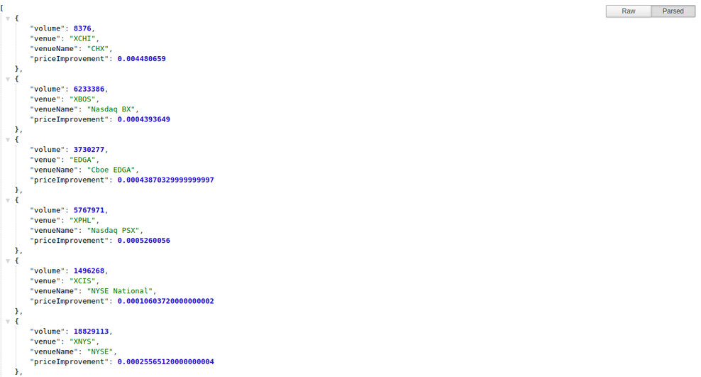

## Building a RestFul Service
This is a microservice that returns stock ticker prices

This RestFul api was built with node.js, express.js kindly drop suggestions and tips:

### `Installation`

- $ git clone repo
- $ cd into repo
- $ npm i
- $ with URL='investors-exchange-iex-trading.p.rapidapi.com' provide respective values for SYMBOL and KEY in .env file
- $ run node server.js

Then navigate to http://localhost:8000/api/v1/stocks to view the demo.

## Gracias ::fire: :fire: :fire:

